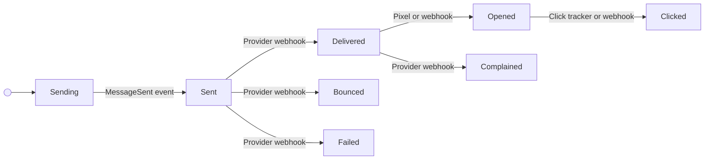
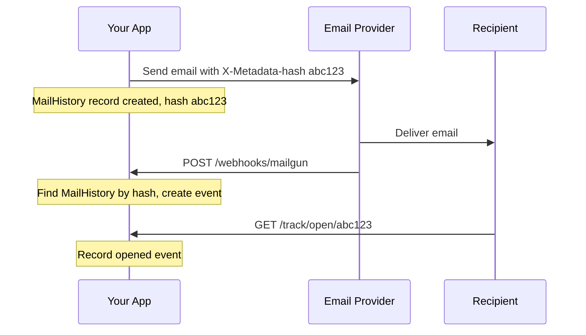

# Delivery Tracking Overview

## The Problem

Laravel's built-in mail events tell you when an email was *sent from your server* — but not what happened after. Did it arrive? Did the recipient open it? Did it bounce?

Mail History's delivery tracking closes this gap by capturing post-delivery events from two sources:

1. **Provider webhooks** — Your email provider (Mailgun, SES, etc.) sends HTTP callbacks when delivery events occur
2. **Self-hosted tracking** — Embedded open pixels and click-redirect links report back directly to your app

## Status Lifecycle



### Status Constants

All statuses are defined in `CleaniqueCoders\MailHistory\MailHistory`:

| Constant | Value | Source |
|----------|-------|--------|
| `STATUS_SENDING` | `Sending` | `MessageSending` event |
| `STATUS_SENT` | `Sent` | `MessageSent` event |
| `STATUS_DELIVERED` | `Delivered` | Provider webhook |
| `STATUS_OPENED` | `Opened` | Open pixel or webhook |
| `STATUS_CLICKED` | `Clicked` | Click tracker or webhook |
| `STATUS_BOUNCED` | `Bounced` | Provider webhook |
| `STATUS_COMPLAINED` | `Complained` | Provider webhook (spam report) |
| `STATUS_FAILED` | `Failed` | Provider webhook |

## Two-Table Design

The `mail_histories` table stores the current status (latest state). The `mail_history_events` table stores every individual event as an append-only log:

```
mail_histories (1 record per email)
├── status: "Opened"  ← always reflects the latest event
└── events (N records per email)
    ├── { type: "delivered", occurred_at: "2025-01-15 10:00:05", provider: "mailgun" }
    ├── { type: "opened",    occurred_at: "2025-01-15 10:05:12", ip: "1.2.3.4" }
    └── { type: "clicked",   occurred_at: "2025-01-15 10:05:18", url: "https://..." }
```

This design lets you:

- Query the latest status quickly (`MailHistory::delivered()->count()`)
- Reconstruct the full timeline (`$mailHistory->getTimeline()`)
- Store raw webhook payloads for debugging

## Hash-Based Correlation

The key challenge in delivery tracking is correlating a webhook callback with the original email. Mail History uses the existing `X-Metadata-hash` header system:



### Provider-Specific Headers

Some providers strip custom headers from webhook payloads. The `InteractsWithMailMetadata` trait now injects the hash into provider-specific fields automatically based on your mail driver:

| Mail Driver | Header Injected | Where Provider Returns It |
|-------------|----------------|--------------------------|
| `mailgun` | `X-Mailgun-Variables` | `event-data.user-variables.hash` |
| `ses` | `X-SES-MESSAGE-TAGS` | `mail.tags.hash` |
| `postmark` | `X-PM-Metadata-hash` | `Metadata.hash` |
| `sendgrid` | `X-SMTPAPI` (unique_args) | `unique_args.hash` |
| `resend` | `X-Entity-Ref-ID` | `data.headers` or `data.tags` |

This happens automatically when you call `configureMetadataHash()`.

## Laravel Events

When a delivery event is recorded, the package dispatches Laravel events so your application can react:

| Event Class | Fired When | Use Case |
|------------|-----------|----------|
| `MailHistoryEventReceived` | Every event (generic) | Logging, metrics |
| `MailDelivered` | Delivery confirmed | Update UI, confirm to user |
| `MailBounced` | Email bounced | Disable bad email address |
| `MailComplained` | Spam complaint | Unsubscribe user, flag account |

### Example: Disable Bounced Email Addresses

```php
// app/Listeners/HandleBouncedEmail.php
namespace App\Listeners;

use CleaniqueCoders\MailHistory\Events\MailBounced;

class HandleBouncedEmail
{
    public function handle(MailBounced $event): void
    {
        $headers = $event->mailHistory->headers;
        $to = $headers['To'] ?? null;

        if ($to) {
            \App\Models\User::where('email', $to)
                ->update(['email_verified_at' => null]);
        }
    }
}
```

Register in `EventServiceProvider`:

```php
protected $listen = [
    \CleaniqueCoders\MailHistory\Events\MailBounced::class => [
        \App\Listeners\HandleBouncedEmail::class,
    ],
];
```

## Model API

### Recording Events

```php
$mailHistory = MailHistory::where('hash', $hash)->first();

$event = $mailHistory->recordEvent('delivered', $rawPayload, [
    'provider' => 'mailgun',
    'occurred_at' => '2025-01-15 10:00:05',
    'ip_address' => '1.2.3.4',
    'user_agent' => 'Mozilla/5.0',
    'url' => 'https://example.com',  // for click events
]);
```

### Querying by Status

```php
// Scopes
MailHistory::delivered()->count();
MailHistory::bounced()->get();
MailHistory::opened()->where('created_at', '>=', now()->subDays(7))->count();
MailHistory::status('Failed')->get();

// Accessors
$mail->is_delivered;  // bool
$mail->is_opened;     // bool
$mail->is_bounced;    // bool
```

### Timeline

```php
$timeline = $mailHistory->getTimeline();
// Returns Collection of MailHistoryEvent ordered by occurred_at

foreach ($timeline as $event) {
    echo "{$event->type} at {$event->occurred_at} from {$event->provider}";
}
```

## Implied Status Backfill

If an email is opened, it was necessarily delivered. If it was clicked, it was necessarily delivered and opened. When `recordEvent()` records an `opened` or `clicked` event, it automatically backfills any missing implied events:

| Event Recorded | Implied Events Created (if missing) |
|---------------|-------------------------------------|
| `opened` | `delivered` |
| `clicked` | `delivered`, `opened` |

This means that even without provider webhooks, self-hosted open/click tracking will produce a complete timeline:

```
Sent → Delivered (implied) → Opened (pixel) → Clicked (redirect)
```

Implied events are timestamped slightly before the actual event to maintain correct timeline ordering. They are not duplicated if the real event already exists from a webhook.

## Tracking Coverage Without Webhooks

Self-hosted tracking (open pixel + click redirect) does not require provider webhooks, but it has blind spots:

| Status | Detectable without webhooks? | Why |
|--------|------------------------------|-----|
| Sending | Yes | Laravel event |
| Sent | Yes | Laravel event |
| Delivered | Partial | Only implied when email is opened |
| Opened | Yes | Tracking pixel |
| Clicked | Yes | Click redirect |
| Bounced | **No** | Only the provider knows |
| Failed | **No** | Only the provider knows |
| Complained | **No** | Only the provider receives spam feedback |

**Key limitation:** If an email bounces, fails, or gets a spam complaint, the record stays as `Sent` forever without webhooks. If an email is delivered but never opened, you won't know it was delivered either.

**Recommendation:** Use webhooks for production. Self-hosted tracking is a supplement, not a replacement.

## Configuration Overview

All delivery tracking features live under three config keys:

```php
// config/mailhistory.php

'webhooks' => [
    'enabled' => env('MAILHISTORY_WEBHOOKS_ENABLED', false),
    // ... provider configs
],

'tracking' => [
    'open'  => ['enabled' => env('MAILHISTORY_TRACK_OPENS', false)],
    'click' => ['enabled' => env('MAILHISTORY_TRACK_CLICKS', false)],
],

'retention' => [
    'enabled' => env('MAILHISTORY_RETENTION_ENABLED', false),
    'days' => env('MAILHISTORY_RETENTION_DAYS', 90),
],
```

## Next Steps

- [Set up webhooks](./02-webhook-setup.md) for your email provider
- [Enable open tracking](./03-open-tracking.md) with pixel injection
- [Enable click tracking](./04-click-tracking.md) with link rewriting
