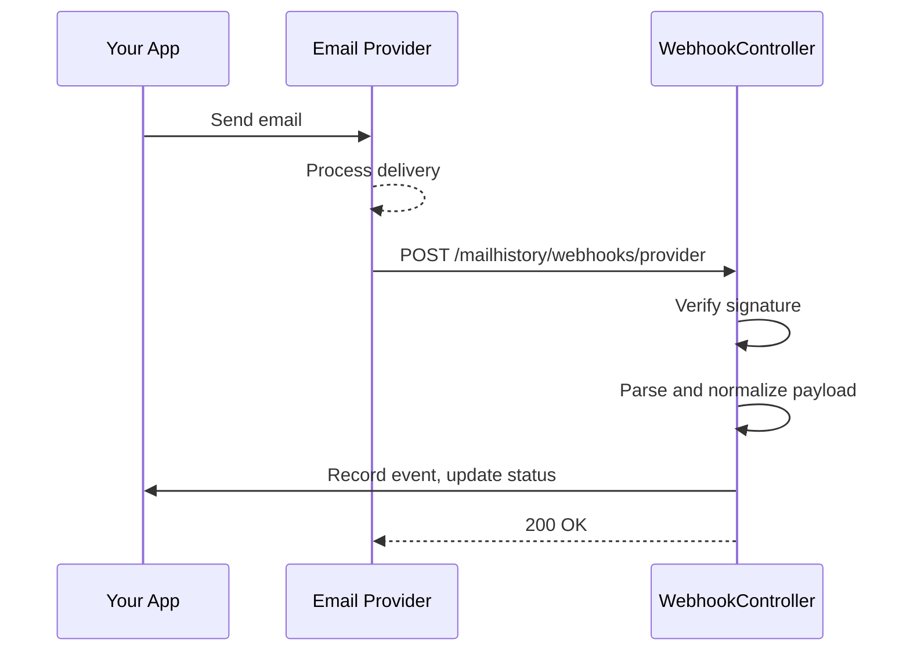

# Webhook Setup

Webhooks allow your email provider to notify your application when delivery events occur (delivered, bounced, opened, clicked, complained).

## How It Works



## General Setup

### 1. Enable Webhooks

```env
MAILHISTORY_WEBHOOKS_ENABLED=true
```

### 2. Publish & Run Migration

```bash
php artisan vendor:publish --tag="mailhistory-migrations"
php artisan migrate
```

### 3. Configure Your Provider

Add the provider's signing key/secret to your `.env` file (see provider sections below).

### 4. Register Webhook URL in Provider Dashboard

Your webhook URL follows this pattern:

```
https://your-app.com/mailhistory/webhooks/{provider}
```

Where `{provider}` is one of: `mailgun`, `ses`, `postmark`, `sendgrid`, `resend`.

## Provider Setup

### Mailgun

**Webhook URL:** `https://your-app.com/mailhistory/webhooks/mailgun`

**Environment:**

```env
MAILHISTORY_MAILGUN_SIGNING_KEY=your-mailgun-webhook-signing-key
```

**Dashboard Setup:**

1. Go to Mailgun Dashboard → Sending → Webhooks
2. Add webhook URL for each event type: Delivered, Opened, Clicked, Permanent Failure, Complained
3. Copy the **Webhook Signing Key** from Settings → API Security

**Signature Verification:** HMAC-SHA256 using `timestamp + token` signed by the webhook signing key.

### Amazon SES

**Webhook URL:** `https://your-app.com/mailhistory/webhooks/ses`

**Dashboard Setup:**

1. Go to AWS Console → SES → Configuration Sets
2. Create or select a configuration set
3. Add an SNS destination for each event type: Delivery, Bounce, Complaint, Open, Click
4. Create an SNS topic and subscribe with HTTPS protocol pointing to your webhook URL
5. Confirm the SNS subscription (the handler auto-confirms `SubscriptionConfirmation` requests)

**Signature Verification:** SNS message signature verified against the AWS signing certificate URL. The handler validates that the certificate URL is from `sns.*.amazonaws.com`.

**Important:** Configure your SES sending to use the configuration set:

```env
MAIL_MAILER=ses
AWS_SES_CONFIGURATION_SET=your-configuration-set
```

### Postmark

**Webhook URL:** `https://your-app.com/mailhistory/webhooks/postmark`

**Environment:**

```env
MAILHISTORY_POSTMARK_WEBHOOK_TOKEN=your-postmark-webhook-token
```

**Dashboard Setup:**

1. Go to Postmark → Servers → Your Server → Settings → Webhooks
2. Add webhook URL
3. Select events: Delivery, Bounce, Spam Complaint, Open, Click
4. Optionally set a webhook token (sent as `X-Postmark-Token` header)

**Signature Verification:** Token-based via `X-Postmark-Token` header. If no token is configured, all requests are accepted (not recommended for production).

### SendGrid

**Webhook URL:** `https://your-app.com/mailhistory/webhooks/sendgrid`

**Environment:**

```env
MAILHISTORY_SENDGRID_VERIFICATION_KEY=your-sendgrid-verification-key
```

**Dashboard Setup:**

1. Go to SendGrid → Settings → Mail Settings → Event Webhook
2. Set HTTP POST URL to your webhook URL
3. Select events: Delivered, Open, Click, Bounce, Spam Report, Dropped
4. Enable **Signed Event Webhook** and copy the verification key

**Signature Verification:** ECDSA signature using the verification key. If no key is configured, all requests are accepted (not recommended for production).

**Note:** SendGrid sends events in batches (arrays), and the handler processes all events in a single request.

### Resend

**Webhook URL:** `https://your-app.com/mailhistory/webhooks/resend`

**Environment:**

```env
MAILHISTORY_RESEND_SIGNING_SECRET=whsec_your-resend-signing-secret
```

**Dashboard Setup:**

1. Go to Resend → Webhooks
2. Add endpoint with your webhook URL
3. Select events: email.delivered, email.opened, email.clicked, email.bounced, email.complained
4. Copy the signing secret (starts with `whsec_`)

**Signature Verification:** Svix-based HMAC-SHA256 using `svix-id`, `svix-timestamp`, and `svix-signature` headers.

## Custom Route Configuration

### Custom Path

Change the webhook base path:

```php
// config/mailhistory.php
'webhooks' => [
    'path' => 'api/mail-webhooks',  // default: 'mailhistory/webhooks'
],
```

Webhook URL becomes: `https://your-app.com/api/mail-webhooks/{provider}`

### Middleware

Add middleware to webhook routes:

```php
'webhooks' => [
    'middleware' => ['throttle:60,1'],
],
```

## Custom Webhook Handlers

You can replace any provider handler with your own implementation:

```php
// config/mailhistory.php
'webhooks' => [
    'providers' => [
        'mailgun' => [
            'handler' => \App\Webhooks\CustomMailgunHandler::class,
            'signing_key' => env('MAILHISTORY_MAILGUN_SIGNING_KEY'),
        ],
    ],
],
```

Your handler must implement `CleaniqueCoders\MailHistory\Webhooks\Contracts\WebhookHandler`:

```php
namespace App\Webhooks;

use CleaniqueCoders\MailHistory\Webhooks\Contracts\WebhookHandler;
use Illuminate\Http\Request;

class CustomMailgunHandler implements WebhookHandler
{
    public function verify(Request $request): bool
    {
        // Your verification logic
    }

    public function handle(Request $request): array
    {
        // Return array of normalized events:
        return [[
            'type' => 'delivered',      // delivered|opened|clicked|bounced|complained|failed
            'hash' => 'abc123',         // The X-Metadata-hash value
            'payload' => [...],         // Raw provider data
            'occurred_at' => '...',     // ISO 8601 timestamp
            'ip_address' => '1.2.3.4',
            'user_agent' => '...',
            'url' => '...',             // For click events
        ]];
    }
}
```

## Testing Webhooks

### Simulated Webhook Command

Test without a real provider:

```bash
# Simulate a delivered event for the latest mail record
php artisan mailhistory:test-webhook mailgun delivered

# Simulate for a specific hash
php artisan mailhistory:test-webhook ses bounced --hash=abc123
```

### Local Development

Use a tunnel service to expose your local webhook URL:

```bash
# Using ngrok
ngrok http 8000

# Then configure webhook URL as:
# https://your-id.ngrok.io/mailhistory/webhooks/mailgun
```

## Troubleshooting

### Webhooks Not Arriving

1. Verify the webhook URL is accessible from the internet
2. Check that `MAILHISTORY_WEBHOOKS_ENABLED=true`
3. Ensure routes are registered: `php artisan route:list --name=mailhistory`
4. Check your provider's webhook logs for delivery failures

### 403 Forbidden Responses

1. Verify the signing key/secret matches your provider's configuration
2. Check that the signature header is being forwarded (some reverse proxies strip headers)
3. For SES: ensure the `SigningCertURL` points to `sns.*.amazonaws.com`

### Events Not Being Recorded

1. Check that the hash in the webhook payload matches a `mail_histories` record
2. Verify `configureMetadataHash()` is called in your Mailable constructor
3. Check `configureProviderHeaders()` is injecting the correct provider-specific header

## Next Steps

- Configure [Open Tracking](./03-open-tracking.md)
- Configure [Click Tracking](./04-click-tracking.md)
- See [Provider Reference](./05-provider-reference.md) for payload formats
