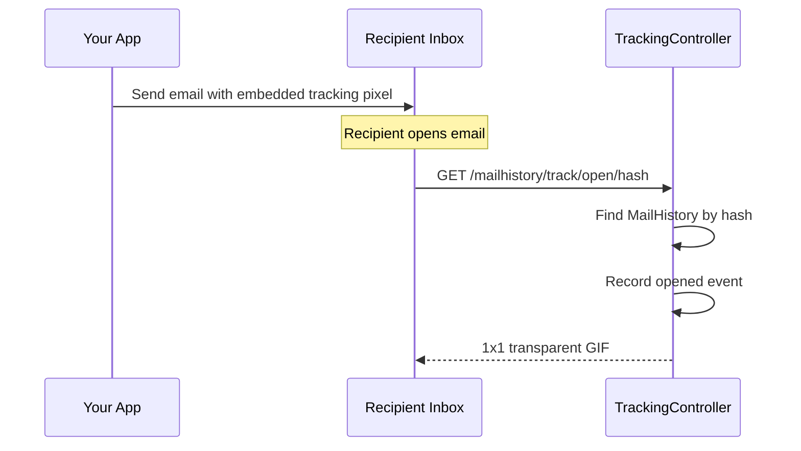

# Open Tracking

Open tracking detects when a recipient opens an email by embedding an invisible 1x1 pixel image. When the email client loads the image, the tracking endpoint records the event.

## How It Works



## Setup

### 1. Enable Open Tracking

```env
MAILHISTORY_TRACK_OPENS=true
```

### 2. Add the Trait to Your Mailable

```php
use CleaniqueCoders\MailHistory\Concerns\InteractsWithMailMetadata;
use CleaniqueCoders\MailHistory\Concerns\InteractsWithOpenTracking;

class WelcomeMail extends Mailable
{
    use InteractsWithMailMetadata;
    use InteractsWithOpenTracking;

    public function __construct()
    {
        $this->configureMetadataHash();
    }
}
```

### 3. Inject the Tracking Pixel

The `injectOpenTrackingPixel()` method adds a 1x1 transparent GIF `` tag just before `</body>` in your HTML content:

```php
public function build()
{
    $content = parent::build();
    $html = $this->injectOpenTrackingPixel($content->render());

    return $this->html($html);
}
```

The injected pixel looks like:

```html

```

## What Gets Recorded

When the pixel is loaded, the tracking controller captures:

| Field | Source |
|-------|--------|
| `type` | `opened` |
| `ip_address` | Request IP |
| `user_agent` | Request User-Agent header |
| `occurred_at` | Current timestamp |

The `MailHistory` record's status is updated to `Opened`.

## Limitations

### Email Client Behavior

Not all email opens are detectable:

- **Image blocking** — Many email clients block images by default (Gmail, Outlook). The open is only recorded when images are loaded.
- **Prefetching** — Some email clients (Apple Mail Privacy Protection) prefetch images automatically, resulting in false positives.
- **Plain text** — If the recipient views the plain text version, no pixel is loaded.
- **Multiple opens** — Each image load records a separate event, so you'll see multiple events for repeated opens.

### Accuracy

Open tracking provides **approximate** data. It is useful for aggregate statistics but should not be relied upon for individual-level certainty.

## Configuration

```php
// config/mailhistory.php
'tracking' => [
    'open' => [
        'enabled' => env('MAILHISTORY_TRACK_OPENS', false),
    ],
    'path' => 'mailhistory/track',  // Base path for tracking routes
    'middleware' => [],               // Additional middleware
],
```

### Custom Path

```php
'tracking' => [
    'path' => 'api/email-track',
],
```

The pixel URL becomes: `https://your-app.com/api/email-track/open/{hash}`

## Response Details

The tracking endpoint returns:

- **Content-Type:** `image/gif`
- **Cache-Control:** `no-store, no-cache, must-revalidate, max-age=0`
- **Body:** 43-byte transparent GIF

The `no-cache` headers prevent the browser/proxy from caching the pixel, ensuring each open attempt hits the server.

If the hash doesn't match any record, the pixel is still returned (to avoid revealing tracking to the recipient).

## Next Steps

- Configure [Click Tracking](./04-click-tracking.md)
- See the [Overview](./01-overview.md) for the full architecture
