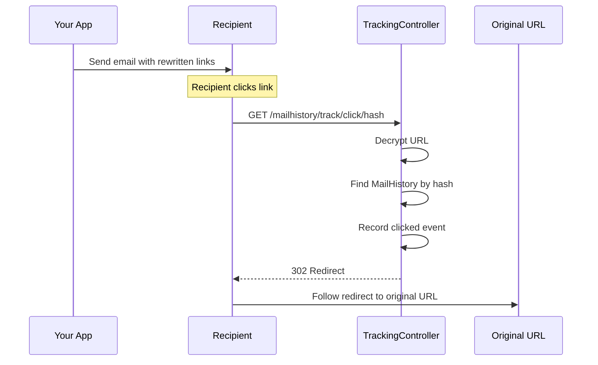

# Click Tracking

Click tracking rewrites links in outgoing HTML emails to route through a tracking redirect. When a recipient clicks a link, the click is recorded before redirecting to the original URL.

## How It Works



## Setup

### 1. Enable Click Tracking

```env
MAILHISTORY_TRACK_CLICKS=true
```

### 2. Add the Trait to Your Mailable

```php
use CleaniqueCoders\MailHistory\Concerns\InteractsWithMailMetadata;
use CleaniqueCoders\MailHistory\Concerns\InteractsWithClickTracking;

class WelcomeMail extends Mailable
{
    use InteractsWithMailMetadata;
    use InteractsWithClickTracking;

    public function __construct()
    {
        $this->configureMetadataHash();
    }
}
```

### 3. Rewrite Links in Your Email

The `rewriteUrlsForClickTracking()` method rewrites all `<a href>` links in the HTML:

```php
public function build()
{
    $content = parent::build();
    $html = $this->rewriteUrlsForClickTracking($content->render());

    return $this->html($html);
}
```

**Before rewriting:**

```html
<a href="https://example.com/pricing">View Pricing</a>
```

**After rewriting:**

```html
<a href="https://your-app.com/mailhistory/track/click/abc123?url={encrypted}">View Pricing</a>
```

## Security: Encrypted URLs

The original URL is encrypted using Laravel's `Crypt::encryptString()` to prevent **open redirect attacks**. Without encryption, an attacker could craft a URL like:

```
/mailhistory/track/click/any-hash?url=https://evil.com
```

With encryption, only URLs encrypted by your app's key are accepted. Invalid or tampered URLs return a `400 Bad Request` response.

## What Gets Recorded

| Field | Source |
|-------|--------|
| `type` | `clicked` |
| `url` | The original (decrypted) destination URL |
| `ip_address` | Request IP |
| `user_agent` | Request User-Agent header |
| `occurred_at` | Current timestamp |

The `MailHistory` record's status is updated to `Clicked`.

## Excluded Links

By default, certain links are **not** rewritten:

| Pattern | Reason |
|---------|--------|
| `mailto:*` | Not an HTTP link |
| `tel:*` | Not an HTTP link |
| `#*` | In-page anchor |
| `javascript:*` | Script link |
| `*unsubscribe*` | Unsubscribe links should go directly to the destination |

### Configuring Exclusions

Add URL patterns to exclude from click tracking:

```php
// config/mailhistory.php
'tracking' => [
    'click' => [
        'enabled' => env('MAILHISTORY_TRACK_CLICKS', false),
        'exclude_patterns' => [
            '*unsubscribe*',
            '*optout*',
            '*preferences*',
        ],
    ],
],
```

Patterns use `fnmatch()` syntax (case-insensitive).

## Combining Open + Click Tracking

You can use both traits together:

```php
class OrderConfirmation extends Mailable
{
    use InteractsWithMailMetadata;
    use InteractsWithOpenTracking;
    use InteractsWithClickTracking;

    public function __construct()
    {
        $this->configureMetadataHash();
    }

    public function build()
    {
        $content = parent::build();
        $html = $content->render();

        // Apply both tracking methods
        $html = $this->rewriteUrlsForClickTracking($html);
        $html = $this->injectOpenTrackingPixel($html);

        return $this->html($html);
    }
}
```

## Configuration

```php
// config/mailhistory.php
'tracking' => [
    'click' => [
        'enabled' => env('MAILHISTORY_TRACK_CLICKS', false),
        'exclude_patterns' => [
            '*unsubscribe*',
        ],
    ],
    'path' => 'mailhistory/track',
    'middleware' => [],
],
```

## Next Steps

- See [Provider Reference](./05-provider-reference.md) for webhook payload details
- Review [Commands](./06-commands.md) for stats and maintenance
