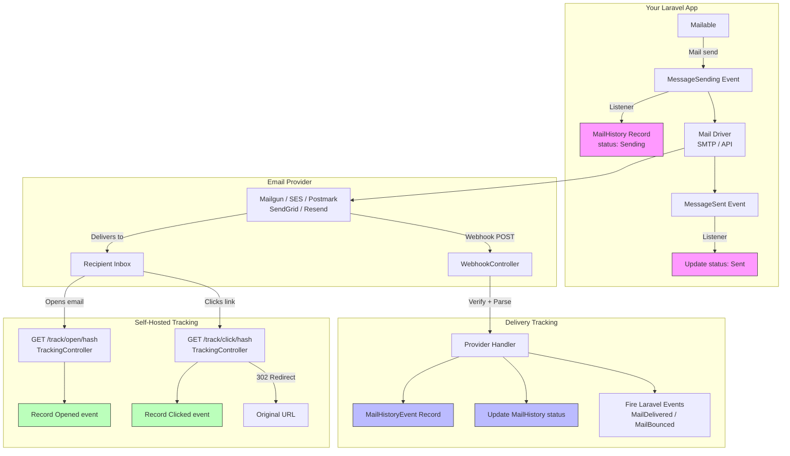
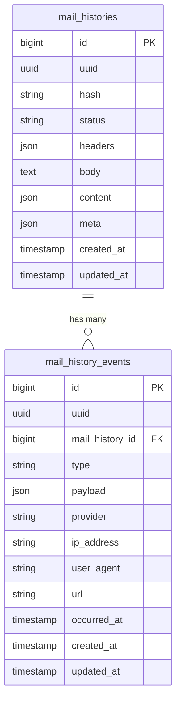

# Delivery Tracking

This section covers the post-delivery email tracking features added in v3.0 — webhook-based status tracking, open pixel tracking, and click tracking.

## Table of Contents

1. [Overview](./01-overview.md) - Architecture and data flow for delivery tracking
2. [Webhook Setup](./02-webhook-setup.md) - Configure provider webhooks (Mailgun, SES, Postmark, SendGrid, Resend)
3. [Open Tracking](./03-open-tracking.md) - Pixel-based email open detection
4. [Click Tracking](./04-click-tracking.md) - Link click tracking with redirect
5. [Provider Reference](./05-provider-reference.md) - Provider-specific configuration and payload formats
6. [Commands](./06-commands.md) - Stats, pruning, and test webhook commands
7. [Reporting & Statistics](./07-reporting.md) - Action-based reporting for dashboards and UI
8. [Dashboard UI](./08-dashboard-ui.md) - Built-in Livewire dashboard

## What's New

Before v3.0, Mail History tracked two statuses:

```
Sending → Sent
```

With delivery tracking, the full email lifecycle is now visible:

```
Sending → Sent → Delivered → Opened → Clicked
                     ↘ Bounced
                     ↘ Complained
                     ↘ Failed
```

## Feature Summary

| Feature | How It Works | Opt-in Config |
|---------|-------------|---------------|
| Webhook Tracking | Provider sends POST to your app | `MAILHISTORY_WEBHOOKS_ENABLED=true` |
| Open Tracking | 1x1 pixel injected into HTML emails | `MAILHISTORY_TRACK_OPENS=true` |
| Click Tracking | Links rewritten through tracking redirect | `MAILHISTORY_TRACK_CLICKS=true` |
| Retention Pruning | Artisan command deletes old records | `MAILHISTORY_RETENTION_ENABLED=true` |

All features are **disabled by default** and fully backward-compatible with existing installations.

**Important:** Open and click tracking work without webhooks, and will automatically backfill implied `Delivered` status when an open or click is detected. However, **bounces, failures, and spam complaints can only be detected via provider webhooks**. See [Tracking Coverage Without Webhooks](./01-overview.md#tracking-coverage-without-webhooks) for details.

## Quick Start

### 1. Publish the New Migration

```bash
php artisan vendor:publish --tag="mailhistory-migrations"
php artisan migrate
```

This creates the `mail_history_events` table alongside your existing `mail_histories` table.

### 2. Enable Webhooks (Provider-Based Tracking)

```env
MAILHISTORY_WEBHOOKS_ENABLED=true
MAILHISTORY_MAILGUN_SIGNING_KEY=your-mailgun-signing-key
```

Then configure the webhook URL in your provider's dashboard:

```
https://your-app.com/mailhistory/webhooks/mailgun
```

### 3. Enable Open & Click Tracking (Self-Hosted)

```env
MAILHISTORY_TRACK_OPENS=true
MAILHISTORY_TRACK_CLICKS=true
```

Add the tracking traits to your Mailable:

```php
use CleaniqueCoders\MailHistory\Concerns\InteractsWithMailMetadata;
use CleaniqueCoders\MailHistory\Concerns\InteractsWithOpenTracking;
use CleaniqueCoders\MailHistory\Concerns\InteractsWithClickTracking;

class OrderConfirmation extends Mailable
{
    use InteractsWithMailMetadata;
    use InteractsWithOpenTracking;
    use InteractsWithClickTracking;

    public function __construct()
    {
        $this->configureMetadataHash();
    }

    public function content(): Content
    {
        return new Content(view: 'emails.order-confirmation');
    }

    public function build()
    {
        $content = parent::build();

        // Inject open tracking pixel and rewrite links
        $html = $this->injectOpenTrackingPixel($content->render());
        $html = $this->rewriteUrlsForClickTracking($html);

        return $this->html($html);
    }
}
```

## Architecture Overview



## Data Model

The delivery tracking system introduces a new `mail_history_events` table that has a one-to-many relationship with the existing `mail_histories` table:



## Next Steps

- Read the [Overview](./01-overview.md) for a full architecture deep-dive
- Set up [Webhooks](./02-webhook-setup.md) for your email provider
- Configure [Open Tracking](./03-open-tracking.md)
- Configure [Click Tracking](./04-click-tracking.md)
